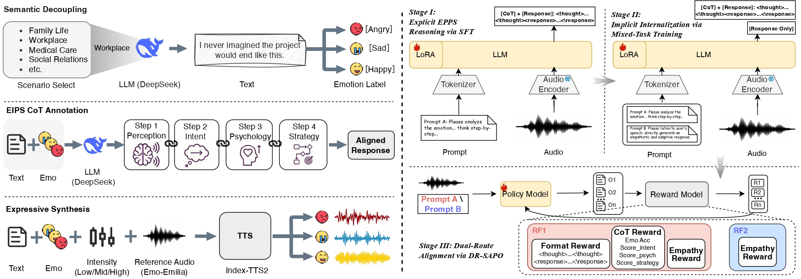

# CogAudio-LLM: Beyond Semantic Dominance in Audio Language Models

> **Official implementation of "Beyond Semantic Dominance: Cognitive Affective Reasoning and Empathetic Response Alignment in Audio Language Models", featuring the LIME-440K dataset.**

<div align="center">

[](#) 
[](#) 
[](#)

</div>

<div align="center">
  
  <p><em>Figure 2: The pipeline of data generation and model training. Left: Construction of the LIME-440K dataset via semantic decoupling, EIPS CoT annotation, and expressive synthesis. Right: The three-stage training architecture of CogAudio-LLM, encompassing explicit reasoning SFT, implicit mixed-task internalization, and DR-SAPO dual-route alignment.</em></p>
</div>

This is the official repository for the paper **"Beyond Semantic Dominance: Cognitive Affective Reasoning and Empathetic Response Alignment in Audio Language Models"** (Submitted to INTERSPEECH 2026).

**Dataset and model weights can be accessed anonymously at:** [https://anonymous.4open.science/r/CogAudio-LLM-4DFE/](https://anonymous.4open.science/r/CogAudio-LLM-4DFE/)

## 💡 Abstract
While Audio Language Models (ALMs) demonstrate strong semantic understanding, they struggle with complex affective interactions. Specifically, textual semantic dominance often overshadows acoustic nuances, and a lack of cognitive depth leads to generic, emotion-agnostic responses. We propose**CogAudio-LLM**, a novel cognitive affective reasoning framework. To mitigate semantic dominance, we build **LIME-440K**, a ``lexically-identical, multi-emotion'' dataset designed to facilitate acoustic-semantic decoupling. We introduce **EIPS** (Emotion Perception, Intent, Psychology, Strategy), a 4-step Chain-of-Thought (CoT) mechanism incorporating psychological reasoning. For inference efficiency, multi-step training explicitly establishes EIPS via SFT, then distills this logic into an implicit generation process. Finally, we design **DR-SAPO** (Dual-Route Soft Adaptive Policy Optimization) to dynamically balance the logical rigor of the CoT with the empathetic quality of the direct response.

## 🚀 News
* **[2026.03]** Paper submitted to INTERSPEECH 2026.
* **[2026.03]** LIME-440K dataset (Parts A & B) uploaded to HuggingFace (Currently private for blind review).

## 📊 Dataset: LIME-440K

To address the fundamental limitations of existing speech datasets, where textual semantics and acoustic emotions are highly coupled and explicit reasoning paths are lacking, we construct LIME-440K (Lexically-Identical, Multi-Emotion), a large-scale bilingual dataset. 

The dataset comprises approximately 440,000 speech utterances totaling roughly 497 hours. To balance emotion specificity and data distribution diversity, the dataset consists of two subsets:

| Subset | Lang. | Emo. x Int. | Spk. | Hrs | Utt. |
| :--- | :---: | :---: | :---: | :---: | :---: |
| **LIME-Core** | | | | | |
| Part A (CN) | CN | 7 x 3 | ~200 | 263.9 | 223,884 |
| Part B (EN) | EN | 7 x 3 | ~200 | 113.8 | 96,000 |
| **LIME-Aug** | | | | | |
| Part C (ECD-TSE) | EN | 5 x 1 | 12 | 90.3 | 84,000 |
| Part D (ESD) | Mix | 5 x 1 | 20 | 29.1 | 35,000 |
| **Total** | **CN/EN** | **7** | **~230** | **497.1** | **438,884** |

### Dataset Access & Explanation

#### 1. LIME-Core (Parts A & B)
A core subset covering 7 fine-grained emotions, constructed specifically using our semantic-acoustic decoupling strategy. 
* 🔒 **Availability:** The data has been uploaded to HuggingFace, but access is currently **restricted** due to the ongoing anonymous peer review process for INTERSPEECH 2026. The public link will be released upon acceptance.

#### 2. LIME-Aug (Parts C & D)
An augmented subset that introduces and re-annotates open-source data (specifically, ECD-TSE and ESD) to expand speaker voices and mapping patterns, thereby enhancing model generalization. 
* **Part C (ECD-TSE):** * *Original Paper:* Towards emotionally consistent text-based speech editing: Introducing emocorrector and the ECD-TSE dataset (Interspeech 2025).
  * *Download:* [GitHub - AI-S2-Lab/EmoCorrector](https://github.com/AI-S2-Lab/EmoCorrector).
* **Part D (ESD):** * *Original Paper:* Seen and unseen emotional style transfer for voice conversion with A new emotional speech dataset (ICASSP 2021).
  * *Download:* [GitHub - HLTSingapore/Emotional-Speech-Data](https://github.com/HLTSingapore/Emotional-Speech-Data).

## 📖 Citation

If you find our work or the LIME-440K dataset helpful, please consider citing our paper:

```bibtex
@article{CogAudioLLM2026,
  title={Beyond Semantic Dominance: Cognitive Affective Reasoning and Empathetic Response Alignment in Audio Language Models},
  author={Anonymous Authors},
  journal={Anonymous submission to Interspeech 2026},
  year={2026}
}
```

If you use **Part C** or **Part D** of our augmented dataset, please also cite the original papers:

```bibtex
@inproceedings{liu2025towards,
  title={Towards emotionally consistent text-based speech editing: Introducing emocorrector and the ECD-TSE dataset},
  author={Rui Liu and Pu Gao and Jiatian Xi and Berrak Sisman and Carlos Busso and Haizhou Li},
  booktitle={Proc. Interspeech},
  year={2025}
}

@inproceedings{zhou2021seen,
  title={Seen and unseen emotional style transfer for voice conversion with A new emotional speech dataset},
  author={Kun Zhou and Berrak Sisman and Rui Liu and Haizhou Li},
  booktitle={Proc. ICASSP},
  pages={920--924},
  year={2021}
}
```
